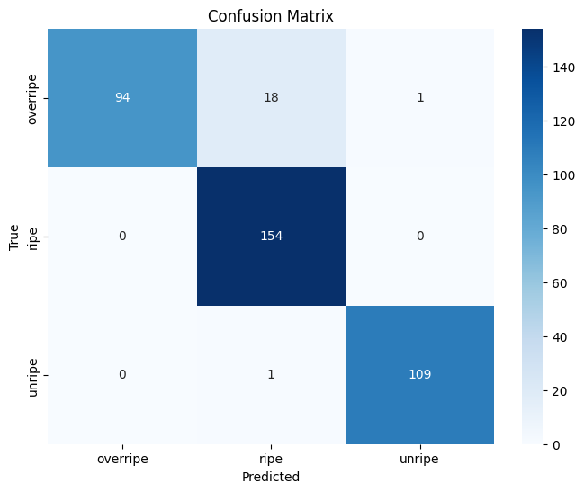

# AI-Based Fruit Classification and Sorting System

## Overview
This repository is part of a major project for the course **AI and Applications**. It is a collaborative effort by a group of three members aimed at building a complete fruit classification and sorting system from scratch. The project is divided into two main sections: **AI** and **Embedded Systems (ESP)**.

Our group started with no prior knowledge of AI or embedded systems, as this is not our primary field of study. Despite this, we achieved a classification accuracy of **95%**, with precision, recall, and F1-score values exceeding **0.90** for most classes.

## Confusion Matrix
The following is the confusion matrix for the classification model:

---

## Team Members and Contributions
Our project team consists of three members, each contributing to different aspects of the system:

- **[Le Duc Anh *](https://github.com/ducanh186)**: Developed the basic idea of the project, optimized the AI model, and implemented the final ESP code.
- **[Chu Thien Phu](https://github.com/chuphu2004)**: Trained the AI model and improved its performance through optimization techniques.
- **[Dang Cong Hoang Nam](https://github.com/HOANGNAM1807)**: Deployed the system on the ESP, ensuring smooth integration and functionality.

We worked collaboratively to build this system from scratch, leveraging each member's unique skill set to achieve the project goals.

---

## Project Structure
### 1. **AI Module**
The AI module involves the training and deployment of a custom fruit classification model. The main tasks include:
- **Model Training**: The model is trained to classify fruits into three categories: `Unripe`, `Ripe`, and `Overripe`.
- **Conversion to TFLite**: The trained model is converted to TensorFlow Lite format for deployment on embedded devices.
- **Deployment**: The TFLite model is deployed on an ESP32-CAM to enable on-device inference.

### 2. **Embedded Systems Module (ESP)**
The embedded systems module focuses on integrating the AI model with hardware for real-world applications:
- **Platforms**: Code is written for both ESP-IDF and Arduino IDE.
- **Optimizations**: Improve processing speed for real-time inference on ESP32.
- **Hardware Integration**: The system uses motors for sorting:
  - `Ripe` fruits are passed through.
  - `Unripe` fruits are directed to the left.
  - `Overripe` fruits are directed to the right.

---

## How to Use
### AI
1. Train the model using the provided AI scripts.
2. Convert the trained model to `.tflite` format.
3. Deploy the `.tflite` model on an ESP32-CAM.

### Embedded Systems
1. Load the TFLite model onto the ESP32 using ESP-IDF or Arduino IDE.
2. Connect the motors and test the sorting mechanism.
3. Fine-tune the system for optimal speed and accuracy.

---

## Future Work
- Enhance the sorting mechanism using additional hardware.
- Further optimize the AI model for better inference speed and accuracy.
- Expand the system to classify additional categories or different fruits.

---

## License
This project is for educational purposes only. Contributions and feedback are welcome.
